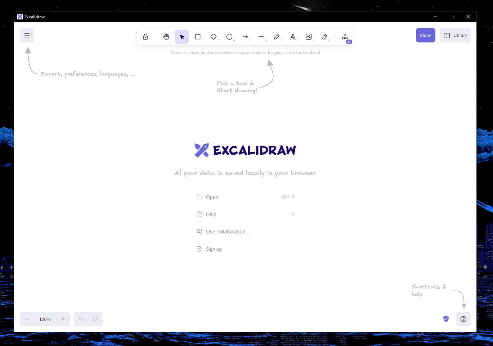

# excalidraw-desktop
Unofficial desktop client for Excalidraw on Windows &amp; MacOS.



# Installation
Head over to the [releases page](https://github.com/pgkt04/excalidraw-desktop/releases/). Follow these steps:
1. Visit the [Releases](https://github.com/pgkt04/excalidraw-desktop/releases/) page.
2. Download the appropriate installer for your operating system:
3. Once downloaded, run the installer and follow the on-screen instructions to install the Excalidraw desktop client.

## Macos Users
If you get the error "Is Damaged and Can’t Be Opened. You Should Move It To The Bin".  
You can run the command:
```bash
xattr -c /Applications/Excalidraw.app
```
This is because I don't have a developer certificate and its not notarized.

# Development or Building
Before building the project, ensure you have the following prerequisites installed on your system:

Prerequisites
Node.js (version 14.x or higher)
npm (comes with Node.js)
To clone and set up the project, follow these steps:

Clone the repository:

```bash
git clone https://github.com/yourusername/excalidraw-desktop.git
cd excalidraw-desktop
```
Install the dependencies:

```bash
npm install
```

# Running
Once the dependencies are installed, you can start the application in development mode.

To run the app in development mode:

```bash
npm run start
```
This command will open the Excalidraw desktop client in a development window.

# Building
To create a production build and generate executable installers for both Windows and macOS:

Run the following command:

```bash
npm run dist
```
This will package the application into a distribution format (e.g., .exe for Windows and .dmg for macOS), which you can then share or install.

The generated installers will be found in the dist folder.

 

